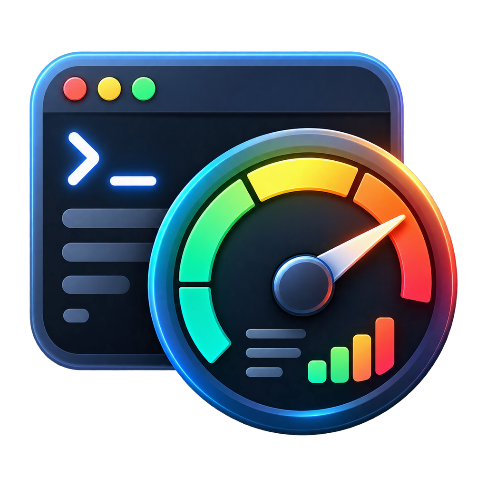
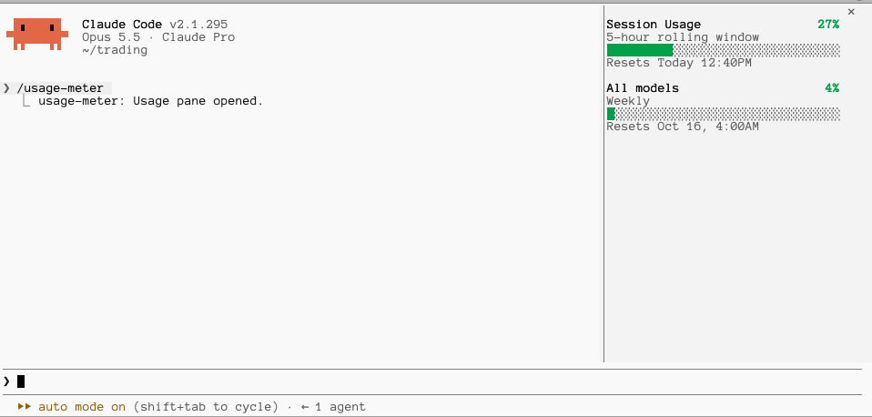

#  usage-meter

A Claude Code mod that shows your usage limits in a small docked pane: the
5-hour session window and the weekly limit, each as a coloured bar (green,
yellow from 70%, red from 90%) with the time it resets.



## Install

Type this at the prompt of a Claude Code session in a terminal:

```
/plugin install usage-meter --marketplace rodrigocamargo/usage-meter
```

Answer `y` to add the marketplace, then press Enter to install for your user.

## Use

- The pane opens by itself when a session starts in a terminal at least
  144 columns wide.
- In a narrower window, type `/usage-meter` to open it.
- The numbers appear after the first reply, on a Claude subscription plan
  (API-key sessions have no usage limits to show).

## What it hooks

The mod only reads your usage and draws a pane. It sends nothing anywhere,
blocks nothing and changes no tool call or prompt.

- `session.start`: registers the `/usage-meter` command, reads your current
  usage limits and opens the pane.
- `command.run` (only for `/usage-meter`): answers that command by opening the
  pane. It does not see or change any other command.
- `session.measure`: when Claude Code reports new usage numbers, stores them so
  the pane redraws.
- `ui.render` (only for its own pane): draws the bars.

## Develop

```
claude plugin validate .
claude plugin test .
claude --plugin-dir .
```

## License

MIT
